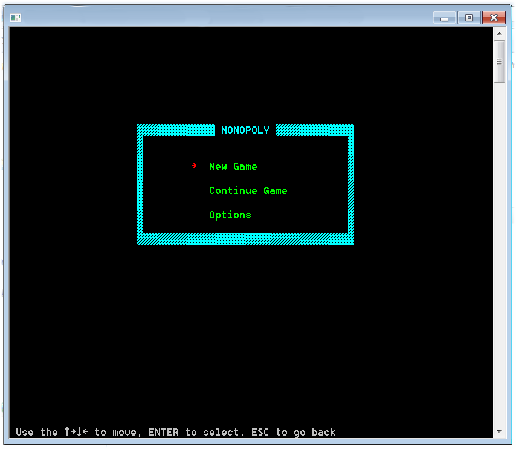
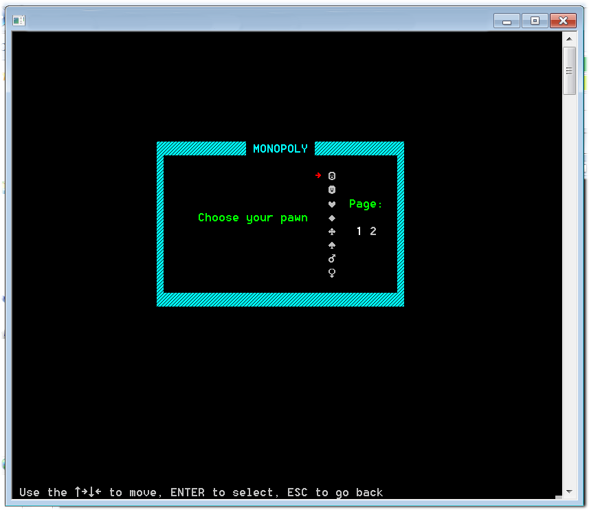
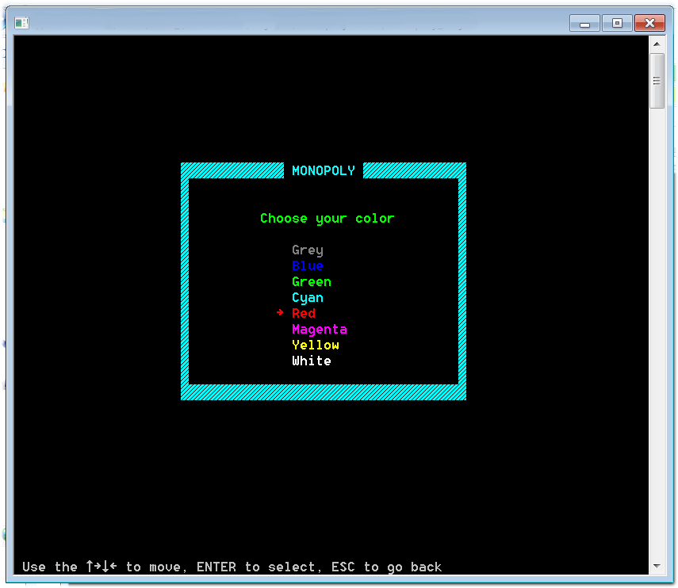

# Monopoly-CMD
## Semester Project for the *Basic Programming Principles* course.

The goal of the project was to create a simplified version of the classic board game *Monopoly*.

Programmed with C language, works on the windows command prompt with ascii characters as graphics.

Features:
* Up to 8 players.
* Player name, pawn and color customization.
* Graphical interface using colored ascii characters
* Rolling two 6-sided dice to move on the table.
* Landing on properties:
 * Buying them if you can afford them and they are available.
 * Paying the owner a renting fee if already taken.
* Building houses on your properties and upgrading them to hotels.
* Playing Decision cards.
* Saving the game state if you wish to play another time.

  

